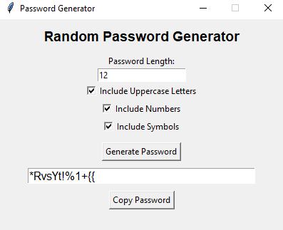

# Random Password Generator

## Description

Random Password Generator is a Python-based application that generates secure and random passwords according to user preferences. Users can choose the password length and include uppercase letters, numbers, and special symbols. The project includes both a Command Line Interface (CLI) version and a Graphical User Interface (GUI) version built using Tkinter.

## Features

* Generate random passwords
* Custom password length
* Include uppercase letters
* Include numbers
* Include special symbols
* User-friendly GUI using Tkinter
* Copy generated passwords to clipboard
* Input validation and error handling

## Technologies Used

* Python
* Tkinter
* Pyperclip
* Git
* GitHub

## Project Structure

Password-Generator/

├── password_generator.py

├── gui_password_generator.py

├── requirements.txt

├── README.md

├── screenshots/

│ └── app.png

└── .gitignore

## Installation

1. Clone the repository:

git clone https://github.com/vikaskomare12/Password-Generator.git

2. Navigate to the project directory:

cd Password-Generator

3. Install dependencies:

pip install -r requirements.txt

## Usage

Run the Command Line Version:

python password_generator.py

Run the GUI Version:

python gui_password_generator.py

## Screenshot

## Learning Outcomes

Through this project, I learned:

* Python programming fundamentals
* Functions and modules
* Random password generation
* Input validation
* Exception handling
* GUI development using Tkinter
* Clipboard integration using Pyperclip
* Git and GitHub workflow
* Project documentation

## Future Improvements

* Password strength indicator
* Dark mode interface
* Multiple password generation
* Save passwords to file
* Advanced security options